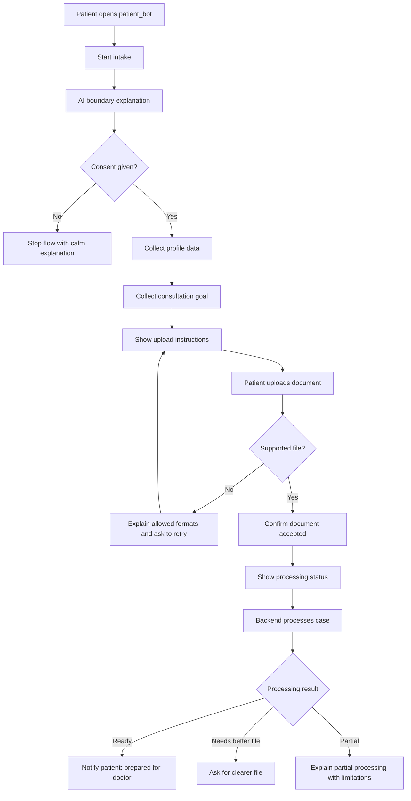
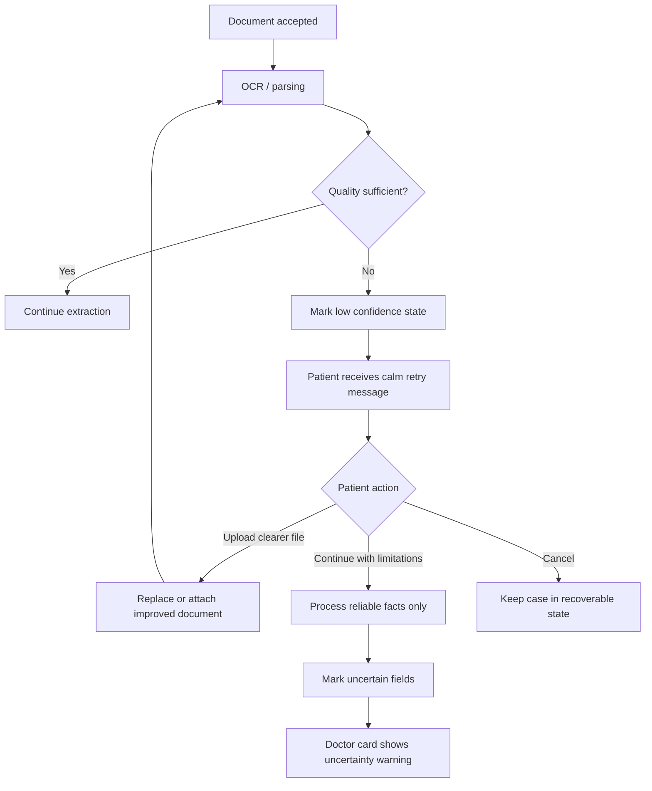
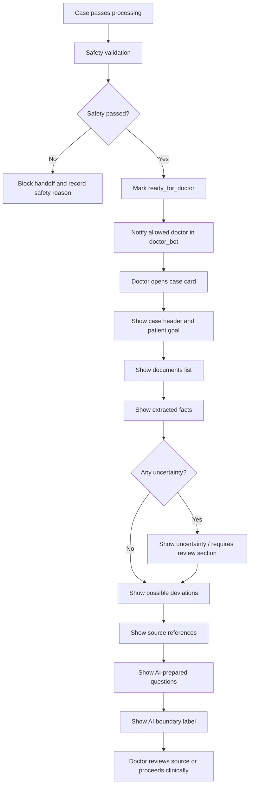

---
stepsCompleted:
  - 1
  - 2
  - 3
  - 4
  - 5
  - 6
  - 7
  - 8
  - 9
  - 10
  - 11
  - 12
  - 13
  - 14
inputDocuments:
  - "_bmad-output/planning-artifacts/prd.md"
  - "_bmad-output/planning-artifacts/product-brief-medical-ai-agent.md"
  - "_bmad-output/planning-artifacts/architecture.md"
  - "_bmad-output/planning-artifacts/epics.md"
  - "_bmad-output/planning-artifacts/implementation-readiness-report-2026-04-26.md"
  - "_bmad-output/planning-artifacts/sprint-change-proposal-2026-04-26.md"
project_name: "medical-ai-agent"
user_name: "Maker"
date: "2026-04-26"
workflowType: "ux-design"
status: "complete"
lastStep: 14
completedAt: "2026-04-26"
---

# UX Design Specification medical-ai-agent

**Author:** Maker
**Date:** 2026-04-26

---

<!-- UX design content will be appended sequentially through collaborative workflow steps -->

## Executive Summary

### Project Vision

Medical AI Agent - это Telegram-first UX поверх backend AI workflow, который помогает подготовить медицинское обращение по анализам без подмены врача. Пользовательский опыт должен показывать, что AI извлекает, структурирует и объясняет происхождение информации, а финальное медицинское решение остается за врачом.

### Target Users

Основные пользователи UX: пациент, врач и portfolio reviewer. Пациенту нужен понятный intake flow: согласие, базовые данные, цель обращения, загрузка документов, статус обработки и восстановление после ошибок. Врачу нужна structured case card с целью пациента, документами, extracted facts, possible deviations, uncertainty markers, source references и AI-prepared questions. Reviewer должен быстро увидеть end-to-end demo, архитектурную зрелость, safety boundaries, provenance и eval evidence.

### Key Design Challenges

Главные UX-вызовы связаны с медицинской осторожностью, Telegram constraints и сложностью AI pipeline. Consent и AI boundary copy должны быть короткими, ясными и не обещать диагноз или лечение. Long-running OCR/LLM processing должен отображаться через понятные статусы. Low-confidence extraction, partial processing и safety failures должны становиться recoverable states с понятным следующим действием. Doctor-facing output должен отделять проверяемые факты от generated narrative и явно показывать uncertainty.

### Design Opportunities

Сильный UX может превратить проект из "бота с LLM" в демонстрацию ответственного AI intake workflow. Patient flow может снизить тревожность через предсказуемые шаги и честные ограничения. Doctor flow может сэкономить время через компактную карточку кейса с источниками и маркировкой надежности. Reviewer flow может усилить portfolio value через быстрый happy path, demo artifacts by `case_id`, safety examples и RAG/source provenance.

## Core User Experience

### Defining Experience

Core experience Medical AI Agent строится вокруг загрузки медицинских документов пациентом и последующей подготовки этих материалов в понятную doctor-facing case card. Самое важное пользовательское действие в MVP - пациент должен без путаницы загрузить анализы или медицинские документы в активный case, после чего система берет на себя распознавание, структурирование, маркировку uncertainty и подготовку handoff для врача.

Главная ценность UX раскрывается не в момент генерации AI text, а в моменте, когда врач быстро понимает кейс: видит цель пациента, список документов, extracted facts, possible deviations, confidence/uncertainty markers, source references и явную границу, что AI не принимает clinical decision.

### Platform Strategy

MVP использует Telegram как основной UX channel. `patient_bot` должен быть оптимизирован под mobile-first touch interaction: короткие сообщения, понятные кнопки, пошаговый intake, загрузка файлов и status updates. `doctor_bot` должен быть компактным review interface: case notification, structured case card, раскрытие деталей по необходимости и быстрый доступ к source references.

Core backend workflow должен оставаться независимым от Telegram, чтобы будущий web dashboard или demo CLI могли использовать те же case, document, extraction, RAG, safety и handoff capabilities.

### Effortless Interactions

Пациенту должно быть легко понять, какие документы можно загрузить, что произошло после upload и что делать при плохом качестве файла. Upload flow должен подтверждать прием документа, показывать статус обработки и давать recovery action без технических деталей OCR или LLM.

Для врача effortless interaction - быстро отличить надежные extracted facts от uncertain или partial results. Case card должна визуально и структурно отделять reliable facts, possible deviations, low-confidence markers, source references и AI-generated narrative. Врач не должен искать, где факт, где интерпретация, а где ограничение уверенности.

### Critical Success Moments

Главный make-or-break момент - врач открывает case card и быстро понимает кейс. Успех наступает, когда врач за 2-3 действия видит, что известно, что требует проверки, какие документы были использованы, какие показатели выделены и где AI ограничивает уверенность.

Если doctor-facing card смешивает факты, AI narrative и uncertainty в один длинный текст, UX провален. Если она помогает врачу быстро перейти от хаотичных документов к проверяемому clinical intake context, UX выполняет основную задачу.

### Experience Principles

1. Документ загружается просто, обработка объясняется спокойно.
2. Doctor-facing UX ставит structured facts выше длинного AI summary.
3. Uncertainty должна быть видимой, а не спрятанной в disclaimers.
4. Каждый важный факт должен иметь понятный source reference или limitation.
5. AI boundary должен быть постоянным: система готовит информацию, врач принимает медицинское решение.

## Desired Emotional Response

### Primary Emotional Goals

UX Medical AI Agent должен вызывать спокойствие, контроль и уверенность у пациента, а у врача - ясность, доверие и контроль. Продукт работает в медицинском контексте, поэтому эмоциональная цель не в развлечении или wow-effect, а в снижении тревоги и в ощущении, что сложный процесс разложен на понятные, проверяемые шаги.

Для пациента успешное эмоциональное состояние: "я правильно передал документы, понимаю что происходит дальше, и система не делает лишних медицинских обещаний". Для врача успешное состояние: "я быстро вижу структуру кейса, понимаю надежность фактов и могу сам принять решение".

### Emotional Journey Mapping

При первом контакте пациент должен почувствовать спокойную ориентированность: бот объясняет, что он делает, что не делает, какие данные нужны и зачем. Во время загрузки документов пациент должен чувствовать контроль: каждый документ принят, статус понятен, следующий шаг очевиден.

Во время обработки документов пациент не должен ощущать зависание или неопределенность. Status updates должны показывать, что кейс движется по этапам, а при проблеме система спокойно объясняет, что исправить.

Когда врач открывает case card, ключевая эмоция - ясность. Врач должен быстро увидеть цель обращения, документы, extracted facts, uncertainty и источники. После просмотра врач должен чувствовать контроль над решением: AI подготовил материалы, но не навязал clinical conclusion.

### Micro-Emotions

Критичные positive micro-emotions:

- confidence вместо confusion;
- trust вместо skepticism;
- calm focus вместо anxiety;
- control вместо helplessness;
- professional clarity вместо перегрузки.

Критичные negative emotions, которых нужно избегать:

- тревога из-за неопределенных или пугающих формулировок;
- путаница из-за длинных сообщений и смешения facts, AI narrative и limitations;
- ложное ощущение, что AI уже сделал медицинский вывод;
- раздражение из-за непонятного статуса обработки;
- недоверие из-за отсутствия sources или uncertainty markers.

### Design Implications

Спокойствие пациента поддерживается короткими сообщениями, предсказуемыми шагами, явным consent, понятным статусом обработки и recovery actions без технических деталей. Контроль пациента поддерживается подтверждением каждого ключевого действия: consent captured, profile saved, document received, processing started, handoff prepared.

Ясность врача поддерживается структурой case card: сначала цель пациента и статус, затем документы, extracted facts, uncertainty, possible deviations, source references и только потом AI-prepared narrative/questions. Доверие врача поддерживается traceability: каждый важный fact должен иметь source reference, confidence или limitation.

Тревогу и путаницу нужно снижать через осторожный тон, отсутствие категоричных клинических выводов, явное разделение reliable и uncertain data, а также постоянную маркировку human-in-the-loop boundary.

### Emotional Design Principles

1. Тон спокойный, профессиональный и сдержанный.
2. Система всегда объясняет следующий шаг.
3. Статусы обработки должны снижать неопределенность, а не добавлять технический шум.
4. Врач всегда видит, где факт, где uncertainty, где AI-prepared text.
5. Safety wording должно успокаивать и прояснять границы, не создавая страха.

## UX Pattern Analysis & Inspiration

### Inspiring Products Analysis

Пользователь не указал конкретные продукты-ориентиры, поэтому UX inspiration для Medical AI Agent строится не на копировании чужого интерфейса, а на transferable patterns из нескольких классов продуктов:

- Guided intake flows: пошаговые формы, где пользователь понимает текущий шаг, зачем нужны данные и что будет дальше.
- File upload workflows: подтверждение приема файла, проверка формата, статус обработки и понятное восстановление после ошибки.
- Professional review tools: компактная структура фактов, статусов, предупреждений и источников для быстрого принятия решения специалистом.
- Trust-sensitive products: явные границы ответственности, спокойный тон, прозрачные статусы и отсутствие чрезмерных обещаний.

Для этого проекта важнее не визуальная оригинальность, а уверенная структура взаимодействия: пациент загружает документы без тревоги, врач видит case card без путаницы.

### Transferable UX Patterns

Ключевые transferable patterns:

- Step-by-step intake: patient flow должен идти по одному вопросу или действию за раз: consent, profile, goal, upload, processing status.
- Immediate upload acknowledgement: после загрузки документа пациент должен сразу получить подтверждение, что файл принят или отклонен с понятной причиной.
- Visible processing states: long-running OCR/LLM stages должны отображаться как понятные статусы, а не как молчание бота.
- Recoverable errors: плохое качество документа, unsupported file или partial extraction должны вести к конкретному следующему действию.
- Structured professional card: doctor-facing view должен группировать данные по смыслу: цель, документы, extracted facts, uncertainty, sources, questions, AI boundary.
- Progressive disclosure: врач сначала видит summary-level structure, а детали source references и provenance раскрываются по необходимости.
- Explicit confidence language: uncertainty и limitations должны быть видимыми рядом с соответствующими facts, а не только в общем disclaimer.

### Anti-Patterns to Avoid

Нужно избегать следующих UX anti-patterns:

- Long chatbot monologues вместо коротких сообщений и ясных действий.
- Смешение extracted facts, AI narrative, possible deviations и limitations в один неструктурированный текст.
- Неявный processing state, когда пользователь не понимает, идет ли обработка.
- Пугающие medical формулировки, которые усиливают тревогу пациента.
- Категоричные AI statements, похожие на диагноз или назначение лечения.
- Скрытая uncertainty, когда low-confidence facts выглядят как надежные.
- Doctor card без source references, где врач не может проверить происхождение показателя.
- Ошибки без recovery action: "не удалось обработать" без объяснения, что делать дальше.

### Design Inspiration Strategy

UX strategy Medical AI Agent должна использовать не декоративные паттерны, а operational clarity patterns.

Adopt:

- пошаговый Telegram intake;
- короткие подтверждения после каждого действия;
- явные статусы обработки;
- structured case card для врача;
- source/provenance indicators для важных facts;
- постоянную AI boundary labeling.

Adapt:

- file upload patterns под медицинские документы и качество OCR;
- professional review patterns под Telegram constraints;
- status tracking под case lifecycle states из backend architecture;
- confidence/uncertainty display под doctor-facing decision support без clinical decision-making.

Avoid:

- marketing-style UX;
- autonomous AI doctor framing;
- длинные AI summaries как основной интерфейс;
- визуальную или текстовую подачу, которая делает uncertain facts похожими на проверенные выводы.

## Design System Foundation

### 1.1 Design System Choice

Для MVP выбран custom lightweight Telegram UX system. Это не полноценная визуальная web design system, а компактная система reusable UX patterns для `patient_bot`, `doctor_bot` и demo/reviewer flows.

Основные building blocks MVP design system:

- message templates для patient-facing и doctor-facing сценариев;
- inline keyboard/button patterns для выбора действий;
- shared case status labels;
- recovery/error message patterns;
- doctor case card sections;
- uncertainty/confidence markers;
- source reference presentation;
- AI boundary labels;
- demo artifact naming/display conventions.

Web dashboard design system откладывается на Post-MVP. Когда появится web dashboard, можно выбрать отдельную themeable component system, но MVP не должен преждевременно проектировать web UI, которого еще нет в scope.

### Rationale for Selection

Custom lightweight Telegram UX system лучше соответствует текущему scope проекта:

- MVP использует Telegram как основной UX channel.
- Core product value находится в backend workflow и doctor handoff, а не в уникальном visual branding.
- Пациентский UX требует ясных сообщений, статусов и recovery actions, а не сложной визуальной системы.
- Врачебный UX требует структурированной case card и маркировки uncertainty в ограничениях Telegram.
- Portfolio value усиливается консистентностью flow и safety wording, а не декоративной UI-оригинальностью.
- Web dashboard явно отложен в Post-MVP, поэтому выбор web component library сейчас создаст лишние решения.

### Implementation Approach

Design system MVP должен быть реализован как набор UX contracts и templates, которые могут использовать bot handlers, tests и future docs.

Рекомендуемые элементы:

- `patient_bot` message templates: start, AI boundary, consent prompt, profile request, goal request, upload instructions, upload accepted, processing status, retry request, deletion confirmation.
- `doctor_bot` message templates: ready-case notification, case card header, patient goal, document list, extracted facts, uncertainty warning, source reference, AI-prepared questions, AI boundary label.
- Shared status vocabulary: user-facing labels для lifecycle states без раскрытия internal implementation details.
- Error/recovery copy: unsupported file, low OCR confidence, partial extraction, safety blocked, source unavailable.
- Case card structure: fixed ordering of sections so doctor review stays predictable.
- Safety wording: reusable labels that prevent autonomous AI doctor framing.

### Customization Strategy

Customization должна быть минимальной и функциональной:

- Тон: спокойный, профессиональный, сдержанный.
- Сообщения: короткие, action-oriented, без длинных объяснений.
- Buttons: только для явных действий, например consent, upload next document, check status, delete case, open source reference.
- Status labels: понятные пользователю, но mapped к backend case states.
- Uncertainty markers: заметные рядом с конкретными facts, а не спрятанные в общем disclaimer.
- Doctor card sections: одинаковый порядок и названия во всех ready/partial/problem case states.
- Safety labels: одинаковая формулировка границы AI в patient, doctor и demo contexts.

Для будущего web dashboard эта Telegram UX system должна стать источником product semantics: статусы, секции карточки, labels, safety copy и uncertainty patterns можно перенести в web design system без изменения core UX logic.

## 2. Core User Experience

### 2.1 Defining Experience

Defining experience Medical AI Agent: пациент загружает медицинские документы в Telegram, а врач получает структурированную case card, где быстро видно, что известно, что сомнительно и на чем основаны выводы.

Ключевая формула UX: "из хаотичных документов в проверяемую карточку кейса". Если эта связка работает, все остальные элементы продукта поддерживают ее: consent объясняет границы, upload flow принимает материалы, processing status снижает неопределенность, extraction/RAG/safety готовят данные, doctor card делает результат понятным.

### 2.2 User Mental Model

Пациент мыслит задачу просто: "я отправляю анализы врачу". Он не думает категориями OCR, extraction, RAG или safety validation. Поэтому patient UX должен говорить языком действий: дать согласие, указать цель, загрузить документ, дождаться обработки, при необходимости загрузить более четкий файл.

Врач мыслит иначе: "мне нужно быстро понять, что передо мной, и можно ли доверять подготовленным данным". Поэтому doctor UX должен быть не conversational, а review-oriented: structured sections, reliability markers, source references и clear AI boundary.

### 2.3 Success Criteria

Core experience успешен, если:

- пациент может загрузить документ без ручной помощи и понимает, что произошло после upload;
- unsupported или плохой документ не ломает flow, а приводит к понятному recovery action;
- processing status показывает движение case без технического шума;
- врач открывает case card и за 2-3 действия понимает цель пациента, документы, extracted facts, uncertainty и source references;
- reliable facts и uncertain facts визуально и текстово различимы;
- AI-prepared text не выглядит как диагноз, назначение лечения или final clinical decision;
- каждый важный fact имеет source reference, confidence marker или limitation.

### 2.4 Novel UX Patterns

UX в основном использует established patterns: guided intake, file upload acknowledgement, status updates, structured review card и progressive disclosure.

Уникальная комбинация проекта находится в doctor-facing presentation: case card должна одновременно показывать medical facts, uncertainty, source provenance и AI boundary в компактном Telegram формате. Это не требует нового жеста или сложного обучения, но требует строгой структуры и повторяемых labels.

Новизна не должна быть визуальной. Она должна проявляться в том, что врач не получает длинный AI answer, а получает проверяемый intake package.

### 2.5 Experience Mechanics

**Initiation:** пациент начинает intake в `patient_bot`, видит короткое объяснение роли AI и дает consent. После этого бот собирает базовые данные и цель обращения.

**Interaction:** пациент загружает PDF или изображение медицинского документа. Бот сразу подтверждает прием файла или объясняет, почему файл не принят. Если файл принят, case переходит в processing state.

**Feedback:** пациент видит понятные статусы: документ принят, идет обработка, требуется повторная загрузка, кейс подготовлен и передан врачу. При low-confidence OCR или partial extraction бот дает одно понятное действие: загрузить более четкий файл или продолжить с ограничениями.

**Completion:** успешный outcome для пациента - кейс подготовлен и передан врачу. Успешный outcome для врача - case card открыта и показывает цель, документы, факты, uncertainty, источники, вопросы и AI boundary.

**Failure Recovery:** unsupported file, плохое качество документа, partial extraction и safety failure должны быть представлены как recoverable states. Пользователь должен видеть следующий шаг, а не внутреннюю ошибку системы.

## Visual Design Foundation

### Color System

Для MVP цветовая система задается как semantic foundation для будущего web dashboard, документации, diagram assets и любых visual artifacts. В Telegram цвета напрямую контролируются ограниченно, поэтому в bot UX color semantics должны выражаться через labels, ordering, wording и consistent markers.

Рекомендуемая палитра:

- Primary: muted teal / blue-green для trust, calm и medical clarity.
- Neutral: warm gray или neutral gray для фона, текста и разделителей.
- Success: restrained green для accepted, processed, ready states.
- Warning: amber для uncertainty, partial extraction, low confidence и requires review.
- Error: restrained red для unsupported file, failed processing, safety blocked.
- Info: muted blue для processing, status updates и source/provenance references.

Semantic mapping:

- `primary` - основные действия и active states.
- `success` - документ принят, кейс подготовлен, safety passed.
- `warning` - uncertainty, partial processing, low confidence, missing source.
- `error` - unsafe output, invalid file, failed processing.
- `info` - processing, source reference, provenance, background status.
- `neutral` - обычный текст, secondary metadata, timestamps, document names.

Цвета не должны создавать ложную клиническую категоричность. Warning и uncertainty должны быть заметными, но не тревожными.

### Typography System

Для Telegram UX typography задается через структуру сообщений, а не через шрифты. Сообщения должны использовать короткие заголовки, короткие абзацы, bullet lists и стабильные названия секций. В будущем web dashboard typography должна быть профессиональной, readable и dense enough for clinical review.

Typography principles:

- Короткие section headings для doctor case card.
- Body text короткий, без длинных AI monologues.
- Metadata и source references отделяются от основных facts.
- Safety labels должны быть заметными, но не доминировать над содержанием.
- Для docs/web later использовать modern sans-serif с хорошей кириллицей и читаемостью: например Inter, system UI или аналог.

Type hierarchy для future web/dashboard:

- Page title / case title: идентификатор case и статус.
- Section heading: цель, документы, показатели, uncertainty, sources, questions.
- Fact row text: показатель, значение, единица, reference context.
- Metadata text: confidence, source document, citation, timestamp.
- Warning text: low confidence, partial extraction, safety limitation.

### Spacing & Layout Foundation

Для Telegram layout foundation выражается в порядке секций и визуальной плотности сообщений. Doctor-facing card должна быть compact but scannable: врач должен быстро пройти глазами по секциям и не читать длинный сплошной текст.

Рекомендуемый порядок doctor case card:

1. Case header: `case_id`, статус, дата.
2. Patient goal.
3. Documents.
4. Extracted facts.
5. Uncertainty / requires review.
6. Possible deviations.
7. Source references.
8. AI-prepared questions.
9. AI boundary label.

Spacing principles:

- Одна смысловая группа - один message block или clearly separated section.
- Секции должны иметь стабильный порядок во всех case states.
- Long content раскрывается progressively, а не показывается все сразу.
- Error/recovery messages должны содержать одну проблему и одно следующее действие.
- Для future web использовать 8px spacing base и плотные review layouts, а не marketing-style cards.

### Accessibility Considerations

UX должен быть readable и predictable даже в Telegram constraints:

- Не полагаться только на цвет для статусов; использовать text labels.
- Uncertainty markers должны быть текстовыми и рядом с конкретным fact.
- Сообщения должны быть короткими и понятными на мобильном экране.
- Buttons должны иметь ясные action labels.
- Medical safety wording должно избегать пугающих формулировок.
- Future web dashboard должен соблюдать достаточный contrast ratio и readable font sizes.
- Critical warnings должны быть distinguishable через wording, placement и repeated status labels, а не только визуальный акцент.

## Design Direction Decision

### Design Directions Explored

Были explored 6 UX directions для Telegram-first MVP и future web/dashboard semantics:

1. Calm Guided Intake - patient-facing upload flow с пошаговым действием, короткими сообщениями и спокойным подтверждением.
2. Clinical Case Card - doctor-facing structured card с compact sections, reliable/uncertain facts и AI boundary.
3. Status Timeline - patient-facing processing state model, показывающий движение case без технического шума.
4. Triage Review - doctor-facing view для partial/problem cases, где сразу видно, что требует проверки.
5. Dense Portfolio Demo - reviewer-facing presentation для workflow, evals, safety и provenance.
6. Source-First Detail - provenance-oriented detail view, где каждый highlighted fact связан с source и limitation.

### Chosen Direction

Выбрана комбинированная direction: Calm Guided Intake + Clinical Case Card + Source-First Detail.

Patient UX берет основу из Calm Guided Intake: короткие шаги, immediate upload acknowledgement, понятный processing status и recovery action.

Doctor UX берет основу из Clinical Case Card: structured sections, fixed ordering, extracted facts before AI narrative, visible uncertainty и clear AI boundary.

Trust/provenance UX берет основу из Source-First Detail: каждый важный fact должен иметь source reference, confidence marker или limitation, доступные врачу без поиска в длинном тексте.

### Design Rationale

Комбинированное направление лучше соответствует core experience: "из хаотичных документов в проверяемую карточку кейса". Оно не пытается сделать Telegram визуально сложным, а усиливает понятность, контроль и доверие.

Patient flow снижает тревогу через пошаговость и подтверждения. Doctor flow снижает когнитивную нагрузку через compact structured review. Source-first details защищают проект от ложной уверенности и помогают показать engineering maturity reviewer'у.

### Implementation Approach

Implementation should define reusable Telegram UX templates:

- patient intake/upload templates from Calm Guided Intake;
- shared status labels from Status Timeline;
- doctor case card section order from Clinical Case Card;
- uncertainty/problem-state patterns from Triage Review;
- provenance/source-reference detail patterns from Source-First Detail;
- reviewer/demo artifact presentation patterns from Dense Portfolio Demo.

В MVP основной runtime UI остается Telegram. HTML showcase используется как planning artifact и visual reference, не как обязательный product surface.

## User Journey Flows

### Patient Document Upload

Пациент начинает intake в `patient_bot`, получает короткое объяснение границ AI, дает consent, вводит базовые данные и цель обращения, затем загружает медицинский документ. Успешный flow должен дать пациенту спокойное ощущение контроля: файл принят, статус понятен, следующий шаг очевиден.

### Poor Quality / Retry Recovery

Если документ плохого качества, UX не должен звучать как технический сбой. Пациент должен понять, что часть данных нельзя надежно прочитать, и получить одно понятное действие: загрузить более четкий файл или продолжить с ограничениями, если это допустимо для demo flow.

### Doctor Case Review

Врач получает уведомление только после readiness gate и safety validation. Case card должна помочь врачу быстро понять кейс: цель, документы, extracted facts, uncertainty, source references, questions и AI boundary. Главный успех - врач за 2-3 действия понимает, что известно и что нужно проверить.

### Journey Patterns

Reusable patterns across journeys:

- One step, one action in patient-facing flow.
- Every upload gets immediate acknowledgement.
- Every long-running state gets a user-facing status.
- Every recoverable error includes one clear next action.
- Doctor-facing content uses fixed section ordering.
- Reliable facts and uncertain facts are always separated.
- Safety boundary appears before sensitive data collection and inside doctor-facing AI content.
- Source references are available near facts, not only in audit artifacts.

### Flow Optimization Principles

- Minimize patient decisions before document upload.
- Avoid technical language in patient errors and statuses.
- Treat low-confidence extraction as a normal recoverable state, not a failure.
- Keep doctor case card compact enough for Telegram review.
- Put structured facts before generated narrative.
- Make uncertainty visible at the point of use.
- Do not show doctor-facing summary until safety validation passes.

## Component Strategy

### Design System Components

Так как MVP использует custom lightweight Telegram UX system, готовой component library нет. Foundation components определяются как reusable message, button и layout patterns внутри `patient_bot`, `doctor_bot` и demo artifacts.

Базовые components MVP:

- Telegram message block.
- Inline keyboard action row.
- Case status label.
- Section heading.
- Fact row.
- Warning / uncertainty marker.
- Source reference link or action.
- AI boundary label.
- Error/recovery message.
- Demo artifact reference.

Эти components должны быть реализованы как templates/contracts, а не как ad hoc строки внутри bot handlers.

### Custom Components

#### Patient Intake Step Message

**Purpose:** Вести пациента через intake по одному действию за раз.  
**Usage:** Start, AI boundary, consent, profile, goal, upload instructions.  
**Anatomy:** short heading, one-sentence explanation, requested action, optional buttons.  
**States:** default, waiting input, validation error, completed.  
**Content Guidelines:** Не использовать медицинские выводы; объяснять зачем нужен шаг.  
**Interaction Behavior:** Пользователь отвечает текстом, файлом или нажатием inline button.

#### Upload Acknowledgement

**Purpose:** Сразу подтвердить, принят ли документ.  
**Usage:** После каждого file upload.  
**Anatomy:** result label, filename/document type, next status, next action if needed.  
**States:** accepted, unsupported, too large, unreadable, duplicate, queued.  
**Content Guidelines:** Ошибка всегда содержит allowed formats или recovery action.  
**Interaction Behavior:** Можно загрузить еще документ, проверить статус или заменить файл.

#### Processing Status Message

**Purpose:** Показывать движение case во время OCR/LLM processing.  
**Usage:** Patient-facing status request или proactive update.  
**Anatomy:** current status label, short explanation, next expected step.  
**States:** documents_uploaded, processing_documents, partial_extraction, ready_for_summary, ready_for_doctor, safety_failed, deleted.  
**Content Guidelines:** Не показывать raw internal errors.  
**Interaction Behavior:** Status can offer retry, upload clearer file, continue with limitations, or wait.

#### Doctor Case Card

**Purpose:** Дать врачу компактное понимание кейса.  
**Usage:** Открытие ready case в `doctor_bot`.  
**Anatomy:** case header, patient goal, documents, extracted facts, uncertainty, possible deviations, sources, questions, AI boundary.  
**States:** ready, partial, requires review, blocked, source unavailable.  
**Content Guidelines:** Facts before generated narrative; uncertainty рядом с фактом.  
**Interaction Behavior:** Врач может открыть source reference, artifacts, status/problem details.

#### Extracted Fact Row

**Purpose:** Показать один медицинский показатель как проверяемый факт.  
**Usage:** Doctor case card, demo artifacts, future dashboard.  
**Anatomy:** indicator name, value, unit, reference context, confidence, source document.  
**States:** reliable, uncertain, missing unit, missing source, out of range, not grounded.  
**Content Guidelines:** Не формулировать диагноз; не скрывать uncertainty.  
**Interaction Behavior:** Source reference раскрывает document/provenance details.

#### Uncertainty Marker

**Purpose:** Сделать low-confidence или partial data заметными.  
**Usage:** Fact row, case card warning, processing status.  
**Anatomy:** marker label, reason, recommended review action.  
**States:** low OCR confidence, missing unit, incomplete value, weak grounding, source unavailable.  
**Content Guidelines:** Спокойный тон, без тревожных формулировок.  
**Interaction Behavior:** Может вести к source reference или retry action.

#### AI Boundary Label

**Purpose:** Постоянно удерживать human-in-the-loop framing.  
**Usage:** Patient explanation, consent, doctor case card, summary, README/demo.  
**Anatomy:** concise label plus one limitation statement.  
**States:** patient-facing, doctor-facing, demo/reviewer-facing.  
**Content Guidelines:** AI готовит информацию, врач принимает медицинское решение.  
**Interaction Behavior:** Не требует действия, но должен быть видим в sensitive moments.

### Component Implementation Strategy

Components should be implemented as centralized bot message templates and formatter functions, not duplicated strings across handlers. Suggested ownership:

- `app/bots/messages.py` for reusable text templates.
- `app/bots/keyboards.py` for inline keyboard patterns.
- `app/schemas` for status/fact/source contracts that drive rendering.
- Tests for critical safety wording, AI boundary labels, status labels and uncertainty rendering.

Message rendering should take typed domain data and return Telegram-safe output. Business logic should stay in services/workflow, not in components.

### Implementation Roadmap

Phase 1 - Core patient upload components:

- Patient Intake Step Message.
- Upload Acknowledgement.
- Processing Status Message.
- Error/Recovery Message.
- AI Boundary Label.

Phase 2 - Doctor review components:

- Doctor Case Card.
- Extracted Fact Row.
- Uncertainty Marker.
- Source Reference Action.
- AI-Prepared Questions Section.

Phase 3 - Portfolio/demo components:

- Demo Artifact Reference.
- Eval Result Summary.
- Provenance Detail View.
- Safety Check Result View.

Priority should follow critical journeys: patient upload first, poor-quality retry second, doctor case review third, reviewer/demo artifacts after runtime flow is coherent.

## UX Consistency Patterns

### Button Hierarchy

В Telegram MVP button hierarchy должна быть простой и action-oriented.

Primary actions используются только для следующего основного шага:

- дать согласие;
- загрузить еще документ;
- проверить статус;
- открыть case card;
- открыть source reference.

Secondary actions используются для альтернатив:

- вернуться назад;
- продолжить с ограничениями;
- загрузить позже;
- открыть artifacts.

Destructive actions требуют явного подтверждения:

- удалить demo case;
- отменить intake;
- заменить документ.

Button labels должны быть короткими и глагольными. Не использовать неоднозначные labels вроде "OK", "Да", "Дальше", если действие можно назвать точнее.

### Feedback Patterns

Feedback должен быть немедленным, спокойным и полезным.

Success feedback:

- подтверждает, что действие принято;
- говорит, что будет дальше;
- не перегружает техническими деталями.

Warning feedback:

- используется для uncertainty, low confidence, partial extraction и missing source;
- объясняет ограничение рядом с конкретным фактом или шагом;
- дает next action, если он есть.

Error feedback:

- используется для unsupported file, invalid input, failed processing или access denied;
- не показывает stack traces, raw OCR/LLM errors или внутренние коды;
- всегда содержит recovery action или спокойное объяснение, почему продолжить нельзя.

Info feedback:

- используется для processing states, source/provenance details и background status;
- должен снижать неопределенность, а не создавать ощущение технического процесса.

### Form Patterns

Patient intake forms должны быть conversational but structured: один вопрос, один ожидаемый ответ.

Validation principles:

- проверять обязательные поля сразу;
- объяснять ошибку простым языком;
- просить исправить только конкретное поле;
- не сбрасывать уже введенные данные;
- не переходить к personal/medical data collection до consent.

Для goal capture бот должен принимать свободный текст, но мягко просить уточнение, если цель пустая или слишком короткая.

Для document upload бот должен явно перечислять поддерживаемые форматы и ограничения только там, где это нужно: в upload instructions и error recovery.

### Navigation Patterns

Navigation в Telegram должна быть state-based, а не menu-heavy. Пользователь всегда должен понимать:

- где он находится в flow;
- какой следующий шаг доступен;
- можно ли вернуться или исправить данные;
- что произойдет после нажатия button.

Patient navigation:

- start intake;
- consent;
- profile;
- goal;
- upload;
- processing status;
- retry/recovery;
- prepared for doctor;
- deletion request.

Doctor navigation:

- ready-case notification;
- open case card;
- view facts;
- view uncertainty/problem details;
- open source reference;
- view questions;
- return to case status/list.

### Additional Patterns

#### Loading / Processing States

Long-running processing никогда не должен выглядеть как молчание. Статус должен быть mapped к lifecycle state и объяснен user-facing языком.

Allowed patterns:

- "Документ принят, идет обработка."
- "Часть данных распознана неуверенно, можно загрузить более четкий файл."
- "Кейс подготовлен и передан врачу."

Avoid:

- raw state names;
- проценты прогресса без надежной основы;
- технические этапы без пользы для пользователя.

#### Empty States

Empty states должны говорить, что нужно сделать дальше.

Examples:

- нет активного case -> начать intake;
- нет документов -> загрузить PDF или фото анализа;
- нет ready cases для врача -> новых подготовленных кейсов нет;
- нет source reference -> явно показать limitation.

#### Safety Boundary Pattern

AI boundary label должен появляться:

- перед consent;
- перед сбором medical documents;
- в doctor case card;
- рядом с AI-prepared summary/questions;
- в README/demo materials.

Базовая формула: AI подготавливает и структурирует информацию для врача; диагноз, лечение и медицинское решение остаются за врачом.

#### Uncertainty Pattern

Uncertainty всегда должна быть привязана к конкретному объекту: document, extracted fact, source, summary claim или case status. Не использовать один общий disclaimer вместо точечной маркировки uncertainty.

#### Source Reference Pattern

Source reference должен быть доступен рядом с extracted fact или highlighted claim. Если источник недоступен, UX должен явно показать limitation, а не скрывать отсутствие traceability.

## Responsive Design & Accessibility

### Responsive Strategy

MVP runtime UX работает внутри Telegram, поэтому responsive strategy должна быть message-first и mobile-first. Основной экран пациента - смартфон. Основной экран врача в MVP также может быть смартфон или desktop Telegram, поэтому doctor case card должна быть readable в узком viewport и не зависеть от сложной сетки.

Patient-facing strategy:

- короткие сообщения, помещающиеся на мобильном экране;
- один основной action за раз;
- upload instructions без длинных списков;
- status updates, которые можно понять без прокрутки большого контекста;
- recovery messages с одним следующим действием.

Doctor-facing strategy:

- compact case card с фиксированным порядком секций;
- длинные детали раскрываются отдельными сообщениями или actions;
- extracted facts grouped in short rows;
- uncertainty рядом с конкретным fact;
- source references доступны через отдельное действие.

Future web dashboard strategy:

- использовать Telegram UX semantics как source of truth;
- на desktop можно показывать multi-column review layout: case summary, facts, sources/artifacts;
- на mobile dashboard сохранять single-column flow;
- не переносить marketing-style layout в operational doctor review.

### Breakpoint Strategy

Для Telegram MVP explicit breakpoints не применяются, но все message templates должны быть readable на мобильных экранах шириной примерно 320px+.

Для future web dashboard рекомендуется стандартная mobile-first стратегия:

- Mobile: 320px-767px, single-column layout.
- Tablet: 768px-1023px, single-column или narrow two-section layout только для secondary metadata.
- Desktop: 1024px+, multi-column review layout допустим для doctor dashboard и demo artifacts.

Основное правило: critical information должна оставаться доступной в single-column layout. Multi-column desktop не должен быть единственным способом понять case.

### Accessibility Strategy

Целевой уровень для будущего web/dashboard и docs: WCAG AA. Для Telegram MVP прямой контроль ниже, но UX должен соблюдать accessibility-compatible principles:

- не полагаться только на цвет для статусов;
- использовать текстовые labels для success, warning, error, uncertainty;
- избегать длинных сообщений;
- не использовать сложные таблицы в Telegram;
- не делать source/provenance доступными только через визуальные hints;
- buttons должны иметь понятные action labels;
- destructive actions требуют подтверждения;
- safety wording должен быть понятным без медицинского или технического жаргона.

Особенно важные accessibility concerns:

- медицинская тревожность: тексты не должны усиливать страх;
- cognitive load: doctor card должна быть structured and scannable;
- low vision/color blindness: warning/error/success должны различаться словами;
- screen reader compatibility future web: semantic headings, lists, buttons and status regions.

### Testing Strategy

MVP Telegram testing:

- проверить patient flow на мобильном Telegram;
- проверить doctor case card на мобильном и desktop Telegram;
- проверить, что длинные filenames, indicator names и source labels не ломают читаемость;
- проверить low-confidence/retry flow;
- проверить deletion confirmation;
- проверить, что safety boundary видна перед consent и в doctor card.

Future web/dashboard testing:

- responsive testing на 320px, 768px, 1024px+;
- keyboard-only navigation;
- screen reader smoke test;
- contrast checking for semantic colors;
- color-blindness simulation for warning/error/success;
- tests for text overflow in case cards and fact rows.

### Implementation Guidelines

Telegram MVP:

- centralized templates in `app/bots/messages.py`;
- centralized keyboards in `app/bots/keyboards.py`;
- no business logic in message templates;
- one message should not mix more than one major purpose;
- use stable section labels across patient and doctor flows;
- make uncertainty textual and local to the relevant fact;
- avoid raw backend state names in user-facing text.

Future web/dashboard:

- use semantic HTML for case card sections;
- use ARIA labels for status and warning regions;
- preserve visible focus indicators;
- maintain minimum 44x44px touch targets;
- use relative units and mobile-first CSS;
- ensure generated content cannot overflow cards/buttons;
- test with long Russian labels and medical indicator names.
