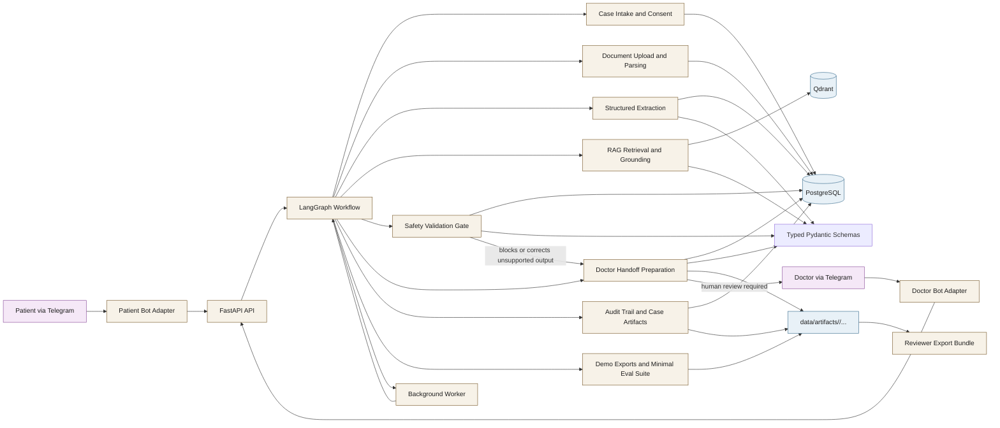

# Architecture Diagram

This diagram is intended to be readable as a standalone portfolio artifact.

## What the diagram shows

- Patient and doctor channels are adapters, not the core system boundary.
- FastAPI is the entry point for backend operations.
- LangGraph coordinates the workflow across intake, documents, extraction, RAG, safety, and handoff.
- PostgreSQL holds case-linked state and audit records.
- Qdrant holds retrieval data separately from relational case data.
- Typed schemas sit between workflow steps so AI outputs are validated before use.
- Demo exports and reviewer bundles remain under `data/artifacts/<case_id>/...`.

## Stable location

This file lives at `docs/architecture-diagram.md` so the README can link to a stable repo-local artifact without depending on generated images or an external service.
